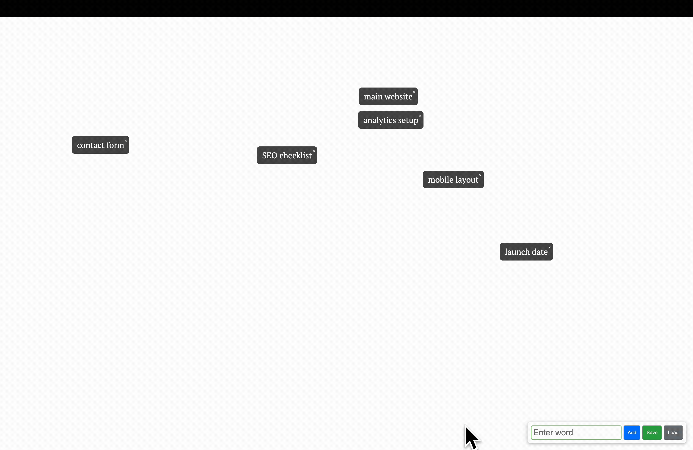

# 🧠 MindMap Chrome Extension

A minimalist Chrome extension for quickly jotting down floating thoughts, ideas, or tags on a clean canvas — like a visual brain dump.

Click the extension icon to open a blank page where you can type, float, save, and reload your ideas.

---



## ✨ Features

- 📌 **Floating text bubbles** — words drift around the screen like free thoughts
- ➕ **Add via textbox** — type a word or phrase and hit `Enter` or click `Add`
- ❌ **Remove with a click** — each bubble has a tiny “×” to delete it
- 💾 **Save / Load** — save your current bubbles to local storage and reload them anytime

---

## 🚀 Installation (Manual)

1. Download or clone this repository.
2. Open Chrome and go to: `chrome://extensions/`
3. Enable **Developer mode** (top right).
4. Click **“Load unpacked”** and select this folder.
5. Click the 🧠 extension icon to launch your mind map!

---

## 🎥 Demo Ideas

This extension is great for:

- Brainstorming ideas  
- Visualizing writing prompts  
- Mood-boarding with words  
- Emotional journaling  
- Freeform mind mapping

---

## 📂 File Structure

```
mindmap-chrome-extension/
├── manifest.json # Chrome extension config
├── background.js # Opens the blank page on click
├── blank.html # The empty canvas
└── content.js # Core logic: add, float, save, load
```

---

## 🛠️ Customization Ideas

- Dark mode toggle
- Export to file
- Drag to rearrange
- Group or connect bubbles
- Synced mind maps via cloud

---

Built by ChatGPT